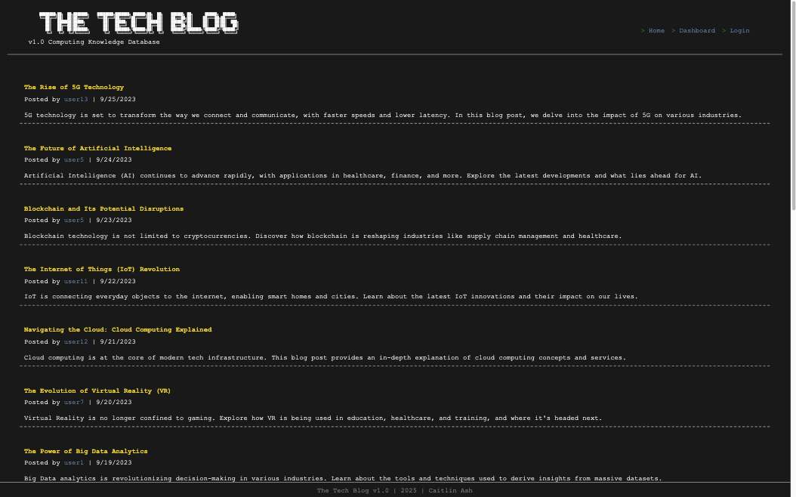
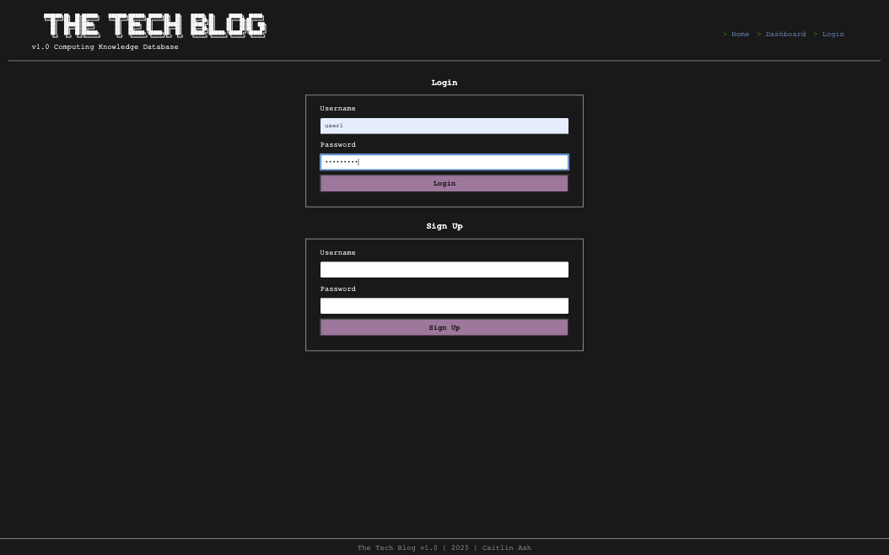
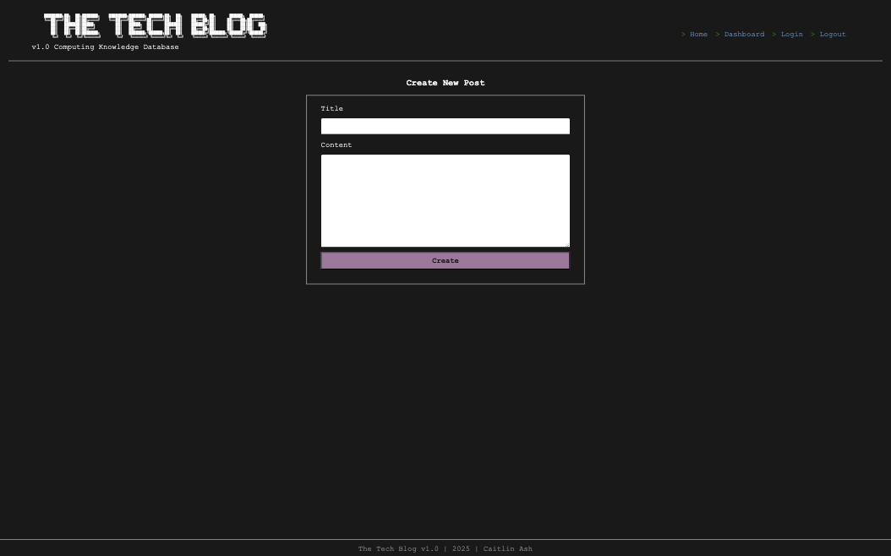
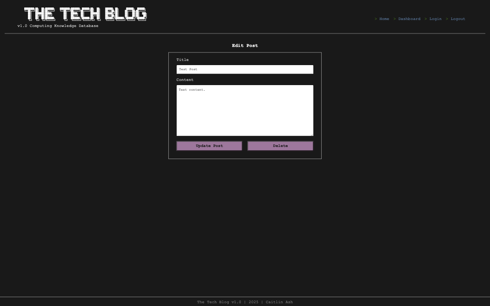
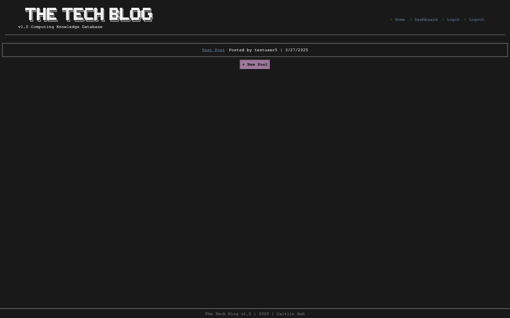
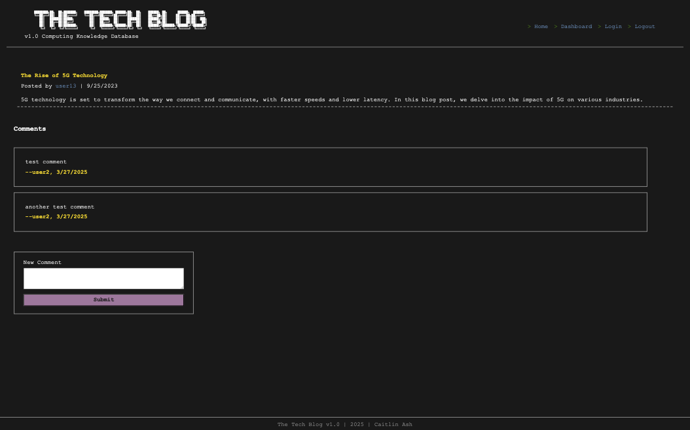

# The Tech Blog

A CMS-Style tech blog site for developers that follows the MVC paradigm.



## Table of Contents
- [📝 Overview](#overview)
- [✨ Features](#features)
- [🛠️ Technologies](#technologies)
- [🧪 Testing](#testing)
- [🔧 Installation](#installation)
- [📂 Project Structure](#project-structure)
- [📚 Usage](#usage)
- [🔌 API Documentation](#api-documentation)
- [🌐 Live Demo](#live-demo)
- [🧩 Challenges and Solutions](#challenges-and-solutions)
- [🚀 Future Improvements](#future-improvements)
- [📊 Learning Outcomes](#learning-outcomes)
- [⚙️ CI/CD](#cicd)
- [📜 License](#license)
- [📫 Contact](#contact)

## Overview

The Tech Blog is a CMS-style blog site that allows developers to publish articles, blog posts, and share their thoughts on tech concepts. Built with the MVC paradigm using Handlebars.js, MySQL, Express.js, and Node.js, this platform enables users to create an account, write posts, edit their content, and interact with other developers through comments.

This project addresses the need for developers to have a dedicated space to publish their insights and learn from others in a community-focused environment. It demonstrates my ability to create full-stack applications with user authentication and database management.

## Features

- **User Authentication:** Secure login and registration system
  
      

- **Content Management:** Create, edit, and delete your tech blog posts
  
  <div style="display: flex; gap: 10px; margin-bottom: 15px;">
  
  
  </div>

- **Personal Dashboard:** Manage all your content in one place
  
  

- **Community Interaction:** Comment on posts from other developers
  
  

## Technologies

### Frontend
- **Markup & Structure:** HTML5
- **Templating Engine:** Handlebars.js
- **Styling:** CSS3

### Backend
- **Runtime Environment:** Node.js
- **Framework:** Express.js
- **Authentication:** Bcrypt, express-session
- **Database:** JawsDB with MySQL
- **ORM:** Sequelize  

### DevOps
- **CI/CD:** GitHub Actions
- **Deployment:** Automatic deployment to Heroku
- **Test Coverage:** Coverage reports as GitHub artifacts

## Testing


This project includes comprehensive test coverage across multiple layers:
- **Framework:** Jest
- **Testing Types:** Unit, Integration, Controller, Model
- **Coverage Analysis:** Jest Coverage Reports
- **API Testing:** Supertest  

### Running Tests

```bash
# run all tests
npm test

# run tests with coverage analysis
npm run test:coverage

# run specific test files
npm test -- tests/models/User.test.js
```

## Installation 

### Prerequisites
<!-- add prerequisites here -->
- Node.js (v14+)
- MySQL
- Git
- npm

### Setup Instructions
```bash
# clone the repo (ssh)
git clone git@github.com:bycait27/tech-blog.git

# navigate to project directory
cd the-tech-blog

# install dependencies
npm install

# set up .env file in root of project 
# add environment variables
DB_NAME='blog_db'
DB_USER='your_mysql_username'
DB_PASSWORD='your_mysql_password'
SESSION_SECRET='your_session_secret'

# seed the data 
npm run seed

# start the development server
npm start

# navigate to server (localhost:3001)
```

## Project Structure

```
the-tech-blog/
|
|-- .github/                   # GitHub Actions workflow files
|   |-- workflows/             # CI/CD pipeline configurations
|-- config/                    # Connection config 
|-- controllers/               # Basic CRUD operations
|   |-- api/                   # API routes
|-- db/                        # Database schema
|-- models/                    # Database models
|-- public/ 
    |-- assets/                # App images for README 
|   |-- css                    # Styles for frontend
|   |-- js                     # Frontend JavaScript
|-- seeds/                     # JSON data and seed functions
|-- tests/                     # Test files
|   |-- controllers/           # Controller tests
|   |-- models/                # Model tests
|   |-- utils/                 # Utility function tests
|   |-- test-utils/            # Testing utilities
|-- utils/                     # Extra helper functions
|-- views/                     # Handlebars.js templates
|-- server.js                  # Entry point
```

## Usage

<!-- step-by-step guide on how to use the app with code examples where appropriate -->

After installing and running the application, you can:
1. **Register an account** with a username and password
2. **Create and add blog posts** through your dashboard page
3. **Edit and delete blog posts** using the dashboard tools available
4. **Comment on other user's posts** via the homepage by clicking on their blog post

### Example API usage
```javascript
// example: get all blog posts
router.get('/', async (req, res) => {
    try {
        const blogPostData = await BlogPost.findAll({
            include: [
                {
                    model: Comment,
                    attributes: ['id', 'content', 'date_created', 'user_id', 'blogpost_id'],
                    include: {
                        model: User,
                        attributes: ['username'],
                    },
                },
                {
                    model: User,
                    attributes: ['username'],
                },
            ],
        });

        res.status(200).json(blogPostData);
    } catch (err) {
        res.status(500).json(err);
    }
});
```

## API Documentation
The API follows RESTful principles: 

| Endpoint             | Method | Description         | Authentication Required |
|:---------------------|:-------|:--------------------|:------------------------|
| `/api/users`         | GET    | Get all users       | No                      |
| `/api/users/:id`     | GET    | Get user by ID      | No                      |
| `/api/users`         | POST   | Create a new user   | No                      |
| `/api/users/login`   | POST   | User login          | No                      |
| `/api/users/logout`  | POST   | User logout         | Yes                     |
| `/api/blogposts`     | GET    | Get all blog posts  | No                      |
| `/api/blogposts/:id` | GET    | Get blog post by ID | No                      |
| `/api/blogposts`     | POST   | Create a blog post  | Yes                     |
| `/api/blogposts/:id` | PUT    | Update a blog post  | Yes                     |
| `/api/blogposts/:id` | DELETE | Delete a blog post  | Yes                     |
| `/api/comments`      | GET    | Get all comments    | No                      |
| `/api/comments`      | POST   | Create a comment    | Yes                     |
| `/api/comments/:id`  | DELETE | Delete a comment    | Yes                     |

## Live Demo

Check out the live application: [The Tech Blog](https://the-tech-blog7-f8ee982770ad.herokuapp.com/)

## Challenges and Solutions

<!-- description of a technical challenge faced and how it was solved and what was learned -->

- **Challenge: Session Management in Heroku**
  - **Solution:** Implemented proper session storage with Sequelize and configured cookies for secure deployment. Added `trust proxy` setting and adjusted cookie parameters to work in production environment.

- **Challenge: Password Hashing and Security**
  - **Solution:** Utilized bcrypt.js for secure password hashing with salt rounds to ensure user credentials are properly protected, preventing potential security vulnerabilities.

- **Challenge: Comment System Implementation**
  - **Solution:** Created a many-to-many relationship between users, posts, and comments using Sequelize associations, enabling proper data retrieval and display while maintaining data integrity.

## Future Improvements

<!-- Functionality I want to add: -->
- Tags for different tech topics 
- Reply to other user's comments
- Like other user's comments
- Link to a user's posts
- The ability to bookmark your favorite posts

## Learning Outcomes

<!-- go into more detail with these -->

- **MVC Architecture:** Implemented proper separation of concerns using the Model-View-Controller pattern, making the codebase more organized and maintainable.

- **Templating Engines:** First time using Handlebars.js as a frontend templating engine, providing valuable experience with server-side rendering before moving to client-side frameworks like React.

- **User Authentication:** Built a complete authentication system with session management, password hashing, and protected routes.

- **Database Relations:** Created complex relationships between users, posts, and comments using Sequelize ORM, demonstrating understanding of relational database design.

- **Heroku Deployment:** Successfully deployed a full-stack application with database connections to Heroku, managing environment variables and database migrations.

- **Data Seeding:** Utilized JSON for initial data population, which streamlined testing and development processes.

- **RESTful API Design:** Developed a comprehensive API following RESTful principles for data operations.

- **Test-Driven Development:** Implemented comprehensive testing strategies across models, controllers, and utilities, ensuring code reliability and easier maintenance.

- **CI/CD Implementation:** Set up a complete GitHub Actions workflow for continuous integration and deployment, automating testing and deployment to Heroku.

- **Code Coverage Analysis:** Used Jest's coverage tools to identify and address gaps in test coverage, improving overall code quality.

## CI/CD 
[](https://github.com/bycait27/tech-blog/actions/workflows/ci.yml)

This project uses GitHub Actions for automated testing and deployment.

### CI Pipeline

On every push and pull request to the `main` and `develop` branches:
- Runs the complete test suite
- Generates coverage reports
- Validates code quality

### CD Pipeline

On successful merges to the `main` branch:
- Automatically deploys to Heroku
- Sets up necessary environment variables
- Updates the production database schema if needed

### Deployment Workflow

1. Feature development occurs on feature branches
2. Pull requests are made to the `develop` branch
3. After CI passes and code review, changes are merged to `develop`
4. When ready for production, `develop` is merged to `main`
5. GitHub Actions automatically deploys to Heroku

## License 

[](https://opensource.org/licenses/MIT)  

see LICENSE file for more details

## Contact

**GitHub:** [@bycait27](https://github.com/bycait27)  
**Portfolio Website:** [caitlinash.io](https://caitlinash.io/)  
**LinkedIn:** [Caitlin Ash](https://www.linkedin.com/in/caitlin-ash/)  

---
*This project was originally created as part of my Full-Stack Developer Bootcamp program.*
